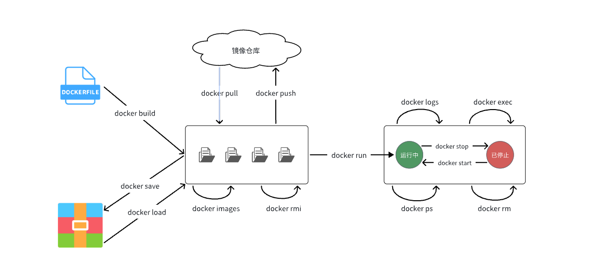

# docker

```
最新笔记资料请访问：
飞书链接：https://b11et3un53m.feishu.cn/wiki/MWQIw4Zvhil0I5ktPHwcoqZdnec?from=from_copylink  密码：j.N?-+4[
```

## 安装

```
# 查看支持的版本
apt-get madison docker-ce
#安装
apt-get install docker-ce -y
```

## 启动

```
systemctl start docker
systemctl status docker
或
service docker start
service docker stop
```

docker  version

docker -v

```
# Docker开机自启
systemctl enable docker

# Docker容器开机自启
docker update --restart=always [容器名/容器id]
```


## 相关目录

````
cd /etc/docker/

vim deamon.json # 源配置信息

cd /var/lib/docker/   # 资源目录
````

## 常用命令

```
docker search  镜像

docker imgage  ...

docker image inspect ubuntu   # 查看详细信息

docker rmi nginx      # 删除镜像
```

| docker pull    | 拉取镜像                       | [docker pull](https://docs.docker.com/engine/reference/commandline/pull/) |
| -------------- | ------------------------------ | ------------------------------------------------------------ |
| docker push    | 推送镜像到DockerRegistry       | [docker push](https://docs.docker.com/engine/reference/commandline/push/) |
| docker images  | 查看本地镜像                   | [docker images](https://docs.docker.com/engine/reference/commandline/images/) |
| docker rmi     | 删除本地镜像                   | [docker rmi](https://docs.docker.com/engine/reference/commandline/rmi/) |
| docker run     | 创建并运行容器（不能重复创建） | [docker run](https://docs.docker.com/engine/reference/commandline/run/) |
| docker stop    | 停止指定容器                   | [docker stop](https://docs.docker.com/engine/reference/commandline/stop/) |
| docker start   | 启动指定容器                   | [docker start](https://docs.docker.com/engine/reference/commandline/start/) |
| docker restart | 重新启动容器                   | [docker restart](https://docs.docker.com/engine/reference/commandline/restart/) |
| docker rm      | 删除指定容器                   | [docs.docker.com](https://docs.docker.com/engine/reference/commandline/rm/) |
| docker ps      | 查看容器                       | [docker ps](https://docs.docker.com/engine/reference/commandline/ps/) |
| docker logs    | 查看容器运行日志               | [docker logs](https://docs.docker.com/engine/reference/commandline/logs/) |
| docker exec    | 进入容器                       | [docker exec](https://docs.docker.com/engine/reference/commandline/exec/) |
| docker save    | 保存镜像到本地压缩文件         | [docker save](https://docs.docker.com/engine/reference/commandline/save/) |
| docker load    | 加载本地压缩文件到镜像         | [docker load](https://docs.docker.com/engine/reference/commandline/load/) |
| docker inspect | 查看容器详细信息               | [docker inspect](https://docs.docker.com/engine/reference/commandline/inspect/) |

\# 发现无法删除，因为容器运行中，强制删除容器 docker rm -f nginx



## 镜像

镜像重命名

```
docker tag nginx:latest nginx01:latest
```

打包镜像

```
docker save -o nginx.tar nginx   # 打包配置好的资源

docker load -i nginx.tar      # 解压
```

## 容器

docker container --help

```
docker ps   # 查看容器
docker ps -a   #查看所有容器

docker run -dit --name myd ubuntu  # dit 守护进程

docker logs myd

docker exec -it myd /bin/bash  # 进入容器 -it交互式

docker stop myd  # 停止容器（对于后台容器，退出不会停止）

docker start myd  #启动容器

docker container rm myd  #删除容器（不能删除真正允许的容器）
```
打包容器成为镜像
```
docker commit 容器名  镜像资源名
```

  

## 部署流程1(手动)

1. 安装系统（Ubuntu）镜像和容器
2. 更新系统容器的软件源（apt-get update）
3. 在系统容器中安装所有需要的环境
4. 将项目文件上传到系统容器中
5. 将系统容器压缩，生成镜像
6. 发送压缩包给他人，解压并创建容器即可使用

## 私有镜像仓库

官方镜像仓库：https://hub.docker.com

```
docker pull registry    # 下载 registry镜像

docker run -d -p 5000:5000 registry   #运行仓库容器

cd  /etc/docker/deamon.json

将 insecure-registries 改为本机私有IP

systemctl restart docker  #重启docker服务
systemctl status docker

docker push image_name  #上传镜像

docker pull image_name  #拉取镜像
```

## 数据卷相关

容器是隔离环境，容器内程序的文件、配置、运行时产生的容器都在容器内部，我们要读写容器内的文件非常不方便。

因此，容器提供程序的运行环境，但是**程序运行产生的数据、程序运行依赖的配置都应该与容器****解耦**。

### 数据卷

**数据卷（volume）**是一个虚拟目录，是**容器内目录**与**宿主机****目录**之间映射的桥梁，创建共享文件目录

将宿主机的某个目录映射到容器中，作为数据存储的目录，我们可以在宿主机上直接对数据进行存储

```
docker run -it -v ~/data:/home ubuntu /bin/bash  # 将本机data目录映射到容器中的home

在data下复制存放项目文件即可

注意：本地目录或文件（宿主机）必须以 / 或 ./开头，如果直接以名字开头，会被识别为数据卷名而非本地目录名。
```

另一个作用是，多个容器之间数据共享


### 数据卷容器

创建模板容器

将宿主机的某个目录，使用容器的方式来表示，然后其他的应用容器将数据保存到这个容器中，达到大批量应用数据同时存储的目的。

```
docker create -v --name temp /data ubuntu  # 创建模板容器，将data映射到ubuntu根目录下

docker run -it --volumes-from temp --name myd ubuntu    # 根据模板创建容器
```

### 数据卷操作

docker volume --help

pwd  查看当前路径

`/var/lib/docker/volumes`这个目录就是默认的存放所有容器数据卷的目录，其下再根据数据卷名称创建新目录，格式为`/数据卷名/_data`。

| **命令**              | **说明**             | **文档地址**                                                 |
| :-------------------- | :------------------- | :----------------------------------------------------------- |
| docker volume create  | 创建数据卷           | [docker volume create](https://docs.docker.com/engine/reference/commandline/volume_create/) |
| docker volume ls      | 查看所有数据卷       | [docs.docker.com](https://docs.docker.com/engine/reference/commandline/volume_ls/) |
| docker volume rm      | 删除指定数据卷       | [docs.docker.com](https://docs.docker.com/engine/reference/commandline/volume_prune/) |
| docker volume inspect | 查看某个数据卷的详情 | [docs.docker.com](https://docs.docker.com/engine/reference/commandline/volume_inspect/) |
| docker volume prune   | 清除数据卷           | [docker volume prune](https://docs.docker.com/engine/reference/commandline/volume_prune/) |

`容器与数据卷的挂载要在创建容器时配置，对于创建好的容器，是不能设置数据卷的。而且**创建容器的过程中，数据卷会自动创建**。`

未定义时，自动创建匿名卷

## 网络管理

-P 随机分配ip和端口

docker run -dit -P --name myd nginx

-p 指定ip和端口映射(宿主机的4000映射到容器的5000)，ip:port：port

docker run -dit -p 4000:5000 --name myd nginx   


在容器内，通过ping命令测试网络 ping 172.17.0.2

| **命令**                  | **说明**                 | **文档地址**                                                 |
| :------------------------ | :----------------------- | :----------------------------------------------------------- |
| docker network create     | 创建一个网络             | [docker network create](https://docs.docker.com/engine/reference/commandline/network_create/) |
| docker network ls         | 查看所有网络             | [docs.docker.com](https://docs.docker.com/engine/reference/commandline/network_ls/) |
| docker network rm         | 删除指定网络             | [docs.docker.com](https://docs.docker.com/engine/reference/commandline/network_rm/) |
| docker network prune      | 清除未使用的网络         | [docs.docker.com](https://docs.docker.com/engine/reference/commandline/network_prune/) |
| docker network connect    | 使指定容器连接加入某网络 | [docs.docker.com](https://docs.docker.com/engine/reference/commandline/network_connect/) |
| docker network disconnect | 使指定容器连接离开某网络 | [docker network disconnect](https://docs.docker.com/engine/reference/commandline/network_disconnect/) |
| docker network inspect    | 查看网络详细信息         | [docker network inspect](https://docs.docker.com/engine/reference/commandline/network_inspect/) |

### 自定义互联

无需指定ip,也可实现容器之间互联

```Bash
# 1.首先通过命令创建一个网络
docker network create hmall

# 2.然后查看网络
docker network ls
# 结果：
NETWORK ID     NAME      DRIVER    SCOPE
639bc44d0a87   bridge    bridge    local
403f16ec62a2   hmall     bridge    local
0dc0f72a0fbb   host      host      local
cd8d3e8df47b   none      null      local
# 其中，除了hmall以外，其它都是默认的网络

# 3.让dd和mysql都加入该网络，注意，在加入网络时可以通过--alias给容器起别名
# 这样该网络内的其它容器可以用别名互相访问！
# 3.1.mysql容器，指定别名为db，另外每一个容器都有一个别名是容器名
docker network connect hmall mysql --alias db
# 3.2.dd容器，也就是我们的java项目
docker network connect hmall dd

# 4.进入dd容器，尝试利用别名访问db
# 4.1.进入容器
docker exec -it dd bash
# 4.2.用db别名访问
ping db
# 结果
PING db (172.18.0.2) 56(84) bytes of data.
64 bytes from mysql.hmall (172.18.0.2): icmp_seq=1 ttl=64 time=0.070 ms
64 bytes from mysql.hmall (172.18.0.2): icmp_seq=2 ttl=64 time=0.056 ms
# 4.3.用容器名访问
ping mysql
# 结果：
PING mysql (172.18.0.2) 56(84) bytes of data.
64 bytes from mysql.hmall (172.18.0.2): icmp_seq=1 ttl=64 time=0.044 ms
64 bytes from mysql.hmall (172.18.0.2): icmp_seq=2 ttl=64 time=0.054 ms
```

## Dockerfile

利用脚本自动化，创建镜像，完成部署

Dockerfile编写格式：

```
# 指定基础镜像
FROM ubuntu:16.04
# 配置环境变量，JDK的安装目录、容器内时区
ENV JAVA_DIR=/usr/local
ENV TZ=Asia/Shanghai
# 拷贝jdk和java项目的包
COPY ./jdk8.tar.gz $JAVA_DIR/
COPY ./docker-demo.jar /tmp/app.jar
# 设定时区
RUN ln -snf /usr/share/zoneinfo/$TZ /etc/localtime && echo $TZ > /etc/timezone
# 安装JDK
RUN cd $JAVA_DIR \
 && tar -xf ./jdk8.tar.gz \
 && mv ./jdk1.8.0_144 ./java8
# 配置环境变量
ENV JAVA_HOME=$JAVA_DIR/java8
ENV PATH=$PATH:$JAVA_HOME/bin
# 指定项目监听的端口，暴露docker该端口
EXPOSE 8080
# 入口，java项目的启动命令
ENTRYPOINT ["java", "-jar", "/app.jar"]
```

```
docker build -t tempimage .  # 执行当前目录下的Dockerfile文件,-t表示生成镜像资源tempimage
```

### 常见命令

```
ADD ./data /home     # 关联路径

RUN  command1 && command2   # 执行命令1和命令2

WORKDIR /home   # 指定进入容器后，所处的目录

```

| **指令**       | **说明**                                     | **示例**                     |
| :------------- | :------------------------------------------- | :--------------------------- |
| **FROM**       | 指定基础镜像                                 | `FROM centos:6`              |
| **ENV**        | 设置环境变量，可在后面指令使用               | `ENV key value`              |
| **COPY**       | 拷贝本地文件到镜像的指定目录                 | `COPY ./xx.jar /tmp/app.jar` |
| **RUN**        | 执行Linux的shell命令，一般是安装过程的命令   | `RUN yum install gcc`        |
| **EXPOSE**     | 指定容器运行时监听的端口，是给镜像使用者看的 | EXPOSE 8080                  |
| **ENTRYPOINT** | 镜像中应用的启动命令，容器运行时调用         | ENTRYPOINT java -jar xx.jar  |

## 部署流程2(Dockerfile)

django 构建一个容器

nginx 构建一个容器

redis 构建一个容器

MySQL 构建一个容器

.....

```
docker run -dit --network-host ubuntu   #让容器使用宿主机的网络，处于相同的网络

即可使用宿主机redis,mysql
或其他容器的服务
```

 

##Docker compose

Docker Compose就可以帮助我们实现**多个相互关联的Docker容器的快速部署**。它允许用户通过一个单独的 docker-compose.yml 模板文件（YAML 格式）来定义一组相关联的应用容器。

可以同时生成多个镜像，启动并运行.

每一个应用容器被称为一个服务（service）。


docker-compose.yml示例:

````
version: "3.8"

services:
  mysql:
    image: mysql
    container_name: mysql
    ports:
      - "3306:3306"
    environment:
      TZ: Asia/Shanghai
      MYSQL_ROOT_PASSWORD: 123
    volumes:
      - "./mysql/conf:/etc/mysql/conf.d"
      - "./mysql/data:/var/lib/mysql"
      - "./mysql/init:/docker-entrypoint-initdb.d"
    networks:
      - hm-net
  hmall:
    build: 
      context: .
      dockerfile: Dockerfile
    container_name: hmall
    ports:
      - "8080:8080"
    networks:
      - hm-net
    depends_on:
      - mysql
  nginx:
    image: nginx
    container_name: nginx
    ports:
      - "18080:18080"
      - "18081:18081"
    volumes:
      - "./nginx/nginx.conf:/etc/nginx/nginx.conf"
      - "./nginx/html:/usr/share/nginx/html"
    depends_on:
      - hmall
    networks:
      - hm-net
networks:
  hm-net:
    name: hmall
````

### 基础命令

```Bash
docker compose [OPTIONS] [COMMAND]
```

| **类型** | **参数或指令**                                               | **说明**                    |
| :------- | :----------------------------------------------------------- | :-------------------------- |
| Options  | -f                                                           | 指定compose文件的路径和名称 |
|| -p       | 指定project名称。project就是当前compose文件中设置的多个service的集合，是逻辑概念 |                             
| Commands | up                                                           | 创建并启动所有service容器   |
|| down     | 停止并移除所有容器、网络                                     |                             
|| ps       | 列出所有启动的容器                                           |                             
|| logs     | 查看指定容器的日志                                           |                             
|| stop     | 停止容器                                                     |                             
|| start    | 启动容器                                                     |                             
|| restart  | 重启容器                                                     |                             
|| top      | 查看运行的进程                                               |                             
|| exec     | 在指定的运行中容器中执行命令                                 |                             

##  部署3（compose）
```
# 5.启动所有, -d 参数是后台启动
docker compose up -d

# 6.查看镜像
docker compose images


# 7.查看容器
docker compose ps
```

